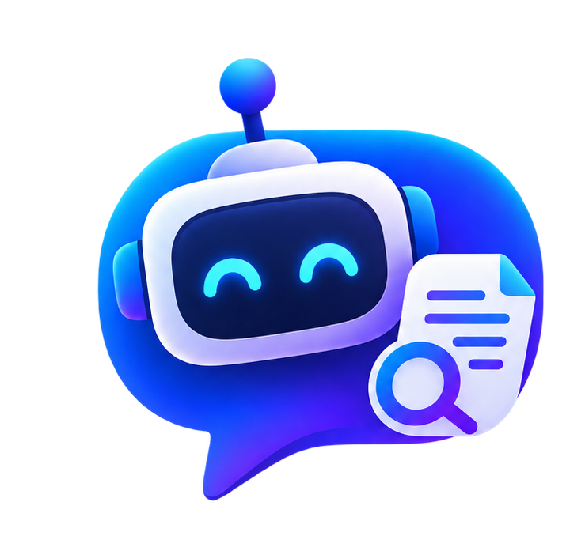

<p align="center">
  
</p>

<h1 align="center">Ragchat</h1>

<p align="center"><strong>A local AI agent that knows your Gmail, Drive, Outlook, Telegram, Discord, and the web.</strong></p>

<p align="center">RAG · Embeddings · BM25 · Hybrid Search · Multi-Agent · Encrypted Local Storage</p>

---

## What it does

You connect your accounts. It syncs the data, chunks it, embeds it, and stores everything locally. When you ask a question, it retrieves the most relevant context using a hybrid of vector search and BM25, fuses the results with RRF, and sends it to an LLM of your choice.

Nothing leaves your machine except the final LLM call.

---

## Architecture

```text
Gmail · Drive · Outlook · OneDrive · Telegram · Discord · Web
                         │
                  Ingestion + Sync
                         │
               Structure-Aware Chunking
                         │
            ┌────────────┴────────────┐
            ▼                         ▼
       Embeddings                    BM25
     Semantic Search            Exact Matching
            │                         │
            └────────────┬────────────┘
                         ▼
                   Hybrid RRF Fusion
                         │
                     Reranking
                         │
                        LLM
                         │
                       Answer
```

---

## What's under the hood

A few things I'm proud of that don't show up in the architecture diagram:

- **Hybrid retrieval (BM25 + Vector + RRF)** — semantic search misses exact names and IDs; BM25 catches what embeddings don't
- **Structure-aware chunker** — tables, headers, and lists are preserved in Markdown before chunking, not stripped
- **SQLCipher encryption** — the local SQLite database is AES-256 encrypted, keys stored in OS Keychain / Credential Manager
- **WAL mode + startup self-healing** — if the DB is corrupted on startup, it quarantines it and rebuilds automatically
- **Playwright subprocess sandbox** — the web crawler runs in an isolated child process so a browser crash can't kill the CLI
- **Resumable streaming for large files** — Drive and OneDrive transfers stream to disk, not RAM; handles files up to 20GB
- **Cython binary distribution** — core logic is compiled to `.so`/`.pyd` files so the source isn't shipped with the public client

---

## Multi-Agent Design

```text
User → Orchestrator → Research Agent  ─┐
                      Action Agent    ──┼→ Review → Response
                      Retrieval Agent ─┘
```

The retrieval, reasoning, and action responsibilities are separated on purpose — one agent with unrestricted access to everything is a prompt-injection waiting to happen. Every external source (emails, channels, web pages) is treated as untrusted input.

---

## RAG Evaluation Targets

| Metric | Target |
|---|---|
| Context Recall | ≥ 0.85 |
| Context Precision | ≥ 0.90 |
| Faithfulness | ≥ 0.95 |
| Answer Relevance | ≥ 0.90 |

---


## Integrations

**Live:** Google (Gmail, Drive, Docs, Sheets, Calendar, Tasks) · Microsoft (Outlook, OneDrive, Calendar, To-Do) · Telegram · Discord · Web crawler


**Planned:** GitHub · Slack · Jira · Notion · Linear · Confluence · AWS · GCP · Azure

---

## Stack

`Python` · `ChromaDB` · `SQLite` · `SQLCipher` · `BM25` · `RRF` · `LiteLLM` · `Playwright` · `Cython` · `Gemini` · `OpenAI` · `Claude` · `Groq` · `Ollama`

---

## Install

**macOS / Linux**
```bash
curl -fsSL https://raw.githubusercontent.com/soumen888/Rag-Chatbot/main/install/macos.sh | bash
ragchat
```

**Windows**

```powershell
irm https://raw.githubusercontent.com/soumen888/Rag-Chatbot/main/install/windows.ps1 | iex
ragchat
```

**[CLI Commands →](commands.md)**

---

## Status


Core pipeline is done. Currently working on: RAGAS evaluation suite, cross-encoder reranking, parent-child retrieval, and stronger prompt injection hardening. MCP is being evaluated selectively not adopted by default.
